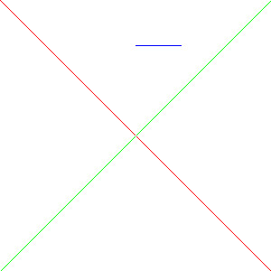
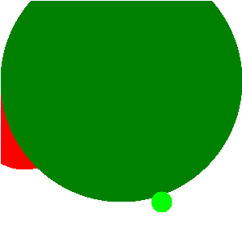
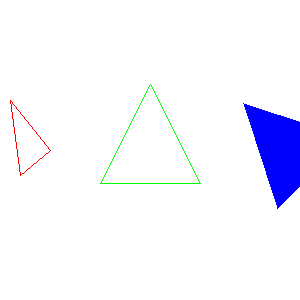
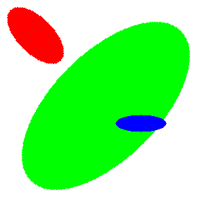
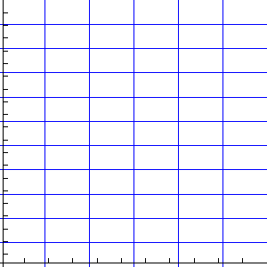

# pom 🍎

## A simple c++ image rendering library for a **quick** render **easy to use** 🚀

📖 You can read the [wiki](https://github.com/FelixDubois/pom/wiki)

With **pom** you can :

### Draw lines 📏

### Draw circles 🟠

### Draw triangles 🟦

### Draw rectangles 🟨

### Draw ellipses 🟢

### Draw grid and axis 📐

### Draw pictures like an artist 🎨

